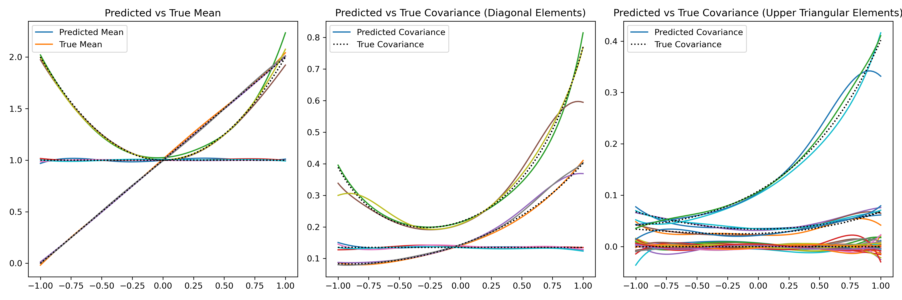
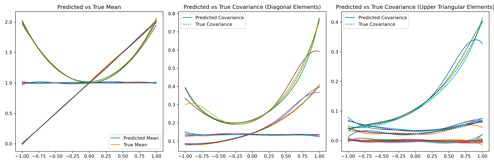

# Multivariate distributional regression

This example demonstrates how to perform multivariate distributional regression using the `ondil` package. We will generate synthetic data from a multivariate normal distribution and fit a model to estimate the parameters of the distribution. The example follows the simulation study of [Muschinski, Thomas, et al. "Cholesky-based multivariate Gaussian regression." Econometrics and Statistics 29 (2024): 261-281](https://www.sciencedirect.com/science/article/pii/S2452306222000168).

## Introduction

Multivariate distributional regression allows us to model mean and covariance matrix of a multivariate response variable as functions of covariates. That is, we have a response variable \(Y \in \mathbb{R}^D\) and covariates \(X \in \mathbb{R}^p\), and we want to model the conditional distribution \(Y|X\) as a multivariate normal distribution with mean vector \(\mu(X)\) and covariance matrix \(\Sigma(X)\). We often have to parameterize the covariance matrix to ensure it is positive definite. A common approach is to use the Cholesky decomposition, where \(\Sigma(X) = L(X)L(X)^T\) and \(L(X)\) is a lower triangular matrix with positive diagonal entries, alternatively the modified Cholesky decomposition can be used.

## Model

We want to model $$ Y \sim \mathcal{N}(\mu(x), \Sigma(x)) $$ where \(y\) is a \(D\)-dimensional response vector, \(x\) is a \(p\)-dimensional covariate vector, \(\mu(x)\) is the mean vector, and \(\Sigma(x)\) is the covariance matrix. The parameters of the model are functions of the covariates, which can be modeled using linear or non-linear functions. We use the two versions of the Cholesky decomposition implemented in `ondil`: the standard Cholesky decomposition and the modified Cholesky decomposition. Both are implemented based on the precision matrix of the multivariate normal \(\Omega = \Sigma^{-1}\). 

- Cholesky decomposition: \(\Omega = L^T L\), where \(L\) is a lower triangular matrix with positive diagonal entries. The parameters to be estimated are the elements of \(L\).
- Modified Cholesky decomposition: \(\Omega = T^T D^{-1} T\), where \(D\) is a diagonal matrix with positive entries and \(T\) is a lower triangular matrix with ones on the diagonal. The parameters to be estimated are the elements of the diagonal of \(D\) and the elements of \(T\) below the diagonal.

The data set is generated by first sampling values of \(x\) from a uniform distribution over the interval \([0, 1]\). For each sampled \(x\), a 3-dimensional vector \(y\) is drawn from a trivariate Gaussian distribution, where the distribution's parameters are functions of \(x\). Each parameter incorporates a combination of constant, linear, and quadratic effects. Denote with $\psi$ the elements of the diagonal vector of the modified Cholesky decomposition of the precision matrix, and with $\phi$ the elements of the lower triangular matrix. The true functions for the mean vector $\mu$, the log of the diagonal elements of the precision matrix $\log(\psi)$, and the lower triangular elements $\phi$ are given in the table below.

| $\mu$ | $\psi$ | $\phi$ |
|-------|--------|--------|
| $\mu_1(x) = 1$ | $\log(\psi_1(x)) = -2$ | $\phi_{1,2}(x) = \frac{1 + x^2}{4}$ |
| $\mu_2(x) = 1 + x$ | $\log(\psi_2(x)) = -2 + x$ | $\phi_{1,3}(x) = 0$ |
| $\mu_3(x) = 1 + x^2$ | $\log(\psi_3(x)) = -2 + x^2$ | $\phi_{2,3}(x) = \frac{3 + x}{4}$ |

We then model each element of $\mu(x)$, \(\log(\text{diag}(D))\), and the elements of \(T\) below the diagonal as B-Spline of the explanatory variable \(x\).

- For the mean $ \mu_i(x) = \sum_{j=1}^{K} \beta_{ij} B_j(x) \quad \text{for } i = 1, \ldots, D $
- For the diagonal elements $ \log(\psi_i(x)) = \sum_{j=1}^{K} \gamma_{ij} B_j(x) \quad \text{for } i = 1, \ldots, D $
- For the off-diagonal elements $ \phi_{i,j}(x) = \sum_{k=1}^{K} \delta_{ijk} B_k(x) \quad \text{for } 1 \leq j < i \leq D $

The figures below show the true and estimated functions for the mean vector and the log of the diagonal elements of the precision matrix, as well as the true and estimated covariance matrices for a three-dimensional example with \(D=3\) and \(M=10000\) samples and for $D=10$ and \(M=10000\) samples.

## Implementation

We use the following code to implement the multivariate distributional regression model using the `ondil` package. The code for generating the figures is provided in the file `examples/multivariate.py` in the [examples folder](https://github.com/simon-hirsch/ondil/tree/main/examples). The snippet below shows the main parts of the implementation for $D=3$.

```python

import matplotlib.pyplot as plt
import numpy as np
import scipy.stats as st
from sklearn.preprocessing import SplineTransformer

from ondil.distributions import (
    MultivariateNormalInverseCholesky,
    MultivariateNormalInverseModifiedCholesky,
)
from ondil.estimators import MultivariateOnlineDistributionalRegressionPath

np.set_printoptions(precision=3, suppress=True)

# Dimension of the data D=3
# Initial training size M=1000
# On my laptop
# For 10k samples and D=10, it takes a two-three mins.
# For 10k samples and D=3, it takes a few seconds.

D = 3
M = 1000


# Define a function to compute the true parameters
def compute_true(x, D=3):
    M = len(x)
    DD = (D // 3 + 1) * 3

    true_mu = np.zeros((M, DD))
    true_D = np.zeros((M, DD, DD))
    true_T = np.zeros((M, DD, DD))

    for i in range(0, D + 1, 3):
        true_mu[:, i + 0] = 1
        true_mu[:, i + 1] = 1 + x
        true_mu[:, i + 2] = 1 + x**2

        true_D[:, i + 0, i + 0] = np.exp(-2)
        true_D[:, i + 1, i + 1] = np.exp(-2 + x)
        true_D[:, i + 2, i + 2] = np.exp(-2 + x**2)

        true_T[:, i + 0, i + 1] = (1 + x**2) / 4
        true_T[:, i + 0, i + 2] = 0
        true_T[:, i + 1, i + 2] = (3 + x) / 4

    true_T[:, range(DD), range(DD)] = -1
    true_T = true_T[:, :D, :D]

    true_D = true_D[:, :D, :D]
    true_mu = true_mu[:, :D]

    return true_mu, true_D, true_T


distribution = MultivariateNormalInverseCholesky()
equation = {
    0: {d: "all" for d in range(D)},
    1: {k: "all" for k in range((D * (D + 1)) // 2)},
}

r = 0
x = st.uniform(-1, 2).rvs((M), random_state=1 + r)
true_mu, true_D, true_T = compute_true(x, D=D)
true_cov = np.linalg.inv(true_T @ np.linalg.inv(true_D) @ true_T.transpose(0, 2, 1))

corr = true_cov / (
    true_cov.diagonal(axis1=1, axis2=2)[..., None] ** 0.5
    @ true_cov.diagonal(axis1=1, axis2=2)[:, None, :] ** 0.5
)

y = np.zeros((M, D))
for m in range(M):
    y[m, :] = st.multivariate_normal(true_mu[m], true_cov[m]).rvs(1)

transformer = SplineTransformer(
    n_knots=4, degree=3, include_bias=False, extrapolation="linear"
)
transformer.fit(np.expand_dims(x, -1))
X = transformer.transform(np.expand_dims(x, -1))

# Model
estimator_chol = MultivariateOnlineDistributionalRegressionPath(
    distribution=distribution,
    equation=equation,
    method={i: "ols" for i in range(D)},
    early_stopping=False,
    early_stopping_criteria="bic",
    iteration_along_diagonal=False,
    max_regularisation_size=None,
    verbose=2,
)

# Fit the estimator
estimator_chol.fit(X, y)

```

## Results

Below we show results for two different dimensions of the response variable \(D=3\) and \(D=10\). We use \(M=10000\) samples in both cases. The results are shown for both the Cholesky decomposition and the modified Cholesky decomposition.

### Low-dimensional example

We estimated the following covariance matrices depending on $x$:


/// caption
True (Black) and estimated Covariance matrix (Colored) for a three-dimensional example D=3 and M=10000 samples using the Cholesky decomposition.
///


/// caption
True (Black) and estimated Covariance matrix (Colored) for a three-dimensional example D=3 and M=10000 samples using the modified Cholesky decomposition.
///

### High-dimensional example

For the higher-dimensional example, we estimated the following covariance matrices depending on $x$. Here we see that the B-Splines get more wiggly, which is expected due to the higher dimensionality and the same number of samples. We can try to counter this behavior by employing some kind of regularization, e.g., ridge or lasso, since these are also implemented in `ondil`.    


/// caption
True (Black) and estimated Covariance matrix (Colored) for a three-dimensional example D=10 and M=10000 samples using the Cholesky decomposition.
///


/// caption
True (Black) and estimated Covariance matrix (Colored) for a three-dimensional example D=10 and M=10000 samples using the modified Cholesky decomposition.
///